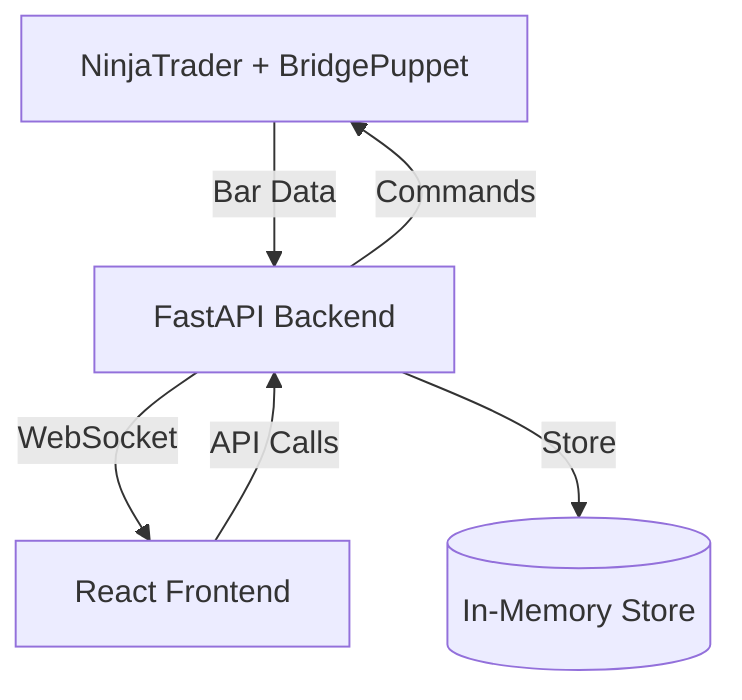

# Design Document - Wyckoff AI Framework Phase 0

## Overview

This design establishes the foundational architecture for a scientific trading framework that integrates NinjaTrader (execution arm), FastAPI backend (analytical brain), and React frontend (control panel). The system enables real-time market data streaming, bidirectional command execution, and live dashboard monitoring.

## Architecture

### System Components



### Communication Flow

1. **Data Flow**: NinjaTrader → Backend → Frontend (via WebSocket)
2. **Command Flow**: Frontend → Backend → NinjaTrader (via long-polling)
3. **Acknowledgment Flow**: NinjaTrader → Backend → Frontend (via WebSocket)

## Components and Interfaces

### BridgePuppet (NinjaScript Strategy)

**Responsibilities:**
- Send OHLCV bar data to backend on each bar close
- Poll backend for commands every 900ms (LIVE mode only)
- Execute received commands (BUY/SELL/FLATTEN/CLOSE)
- Send acknowledgments back to backend
- Maintain connection health monitoring

**Key Methods:**
```csharp
private void SendBarData(string symbol, DateTime timestamp, double o, double h, double l, double c, long volume)
private async Task<Command> PollCommands()
private void ExecuteCommand(Command cmd)
private void SendAcknowledgment(string cmdId, string status, string message)
```
### FastAPI Backend

**Responsibilities:**
- Receive and store bar data from BridgePuppet
- Manage command queues with long-polling
- Broadcast real-time updates via WebSocket
- Maintain bot status and health monitoring
- Handle CORS and proxy configuration

**API Endpoints:**
```python
# Health and Status
GET  /api/v1/health
GET  /api/v1/bots

# Bar Data Ingestion
POST /api/v1/bars/batch
POST /api/bar-data  # Form compatibility

# Command System
GET  /api/v1/commands/{bot_id}     # Long-poll (900ms timeout)
POST /api/v1/commands/{bot_id}     # Enqueue command
POST /api/v1/commands/{bot_id}/ack # Receive acknowledgment

# WebSocket
WS   /ws/live                      # Real-time updates
```

**WebSocket Events:**
- `bar_update`: New OHLCV data received
- `bot_status`: Bot connection/mode changes  
- `command_ack`: Command execution status
- `health_update`: System health changes

### React Frontend

**Responsibilities:**
- Display real-time price data from WebSocket
- Provide manual trading interface
- Show bot status and connection health
- Handle command sending and acknowledgment tracking
- Manage error states and reconnection

**Key Components:**
```jsx
<LivePriceDisplay />      // Real-time OHLCV from WebSocket
<ManualTradingPanel />    // Send BUY/SELL/FLATTEN commands
<BotStatusPanel />        // Show LIVE/BACKTEST mode, last seen
<ConnectionStatus />      // Backend health, WebSocket status
<CommandLog />           // Command history and ACKs
```
## Data Models

### Bar Data Contract
```json
{
  "botId": "bot-1",
  "timestamp": "2026-01-05T01:45:00.000Z",
  "symbol": "MNQ", 
  "timeframe": "1 Minute",
  "open": 21150.25,
  "high": 21152.75,
  "low": 21149.50,
  "close": 21151.00,
  "volume": 1250,
  "mode": "LIVE"
}
```

### Command Contract
```json
{
  "id": "cmd_1767576679413",
  "action": "BUY",
  "qty": 1,
  "slTicks": 10,
  "tpTicks": 20,
  "tag": "manual",
  "symbol": "MNQ",
  "enqueuedAt": "2026-01-05T01:45:00.000Z",
  "botId": "bot-1"
}
```

### Acknowledgment Contract
```json
{
  "id": "cmd_1767576679413",
  "status": "FILLED",
  "message": "Order executed successfully",
  "orderId": "NT_12345",
  "avgFillPrice": 21151.25,
  "filledQty": 1,
  "ts": "2026-01-05T01:45:01.500Z"
}
```

### WebSocket Message Format
```json
{
  "type": "bar_update",
  "data": {
    "botId": "bot-1",
    "symbol": "MNQ",
    "price": 21151.00,
    "timestamp": "2026-01-05T01:45:00.000Z",
    "volume": 1250
  }
}
```
## Correctness Properties

*A property is a characteristic or behavior that should hold true across all valid executions of a system-essentially, a formal statement about what the system should do. Properties serve as the bridge between human-readable specifications and machine-verifiable correctness guarantees.*

### Data Flow Properties

**Property 1: Bar data transmission timing**
*For any* bar data received by BridgePuppet, the transmission to backend should complete within 100ms
**Validates: Requirements 1.1**

**Property 2: Bar data structure completeness**
*For any* bar data sent by BridgePuppet, it should contain all required fields: botId, timestamp, symbol, timeframe, OHLCV, and mode
**Validates: Requirements 1.2**

**Property 3: Bar data JSON serialization round-trip**
*For any* valid bar data object, serializing to JSON then deserializing should produce an equivalent object
**Validates: Requirements 1.4**

**Property 4: Bar data storage and broadcast**
*For any* bar data received by backend, it should be stored in memory and broadcast via WebSocket to all connected clients
**Validates: Requirements 1.5**

### Command System Properties

**Property 5: Command enqueue with unique identifiers**
*For any* command sent from frontend, the backend should enqueue it with a unique ID and timestamp
**Validates: Requirements 2.1**

**Property 6: Command queue FIFO behavior**
*For any* sequence of commands enqueued, BridgePuppet polling should receive them in first-in-first-out order (LIVE mode only)
**Validates: Requirements 2.2**

**Property 7: Empty queue timeout behavior**
*For any* polling request when no commands are available, the backend should wait up to 900ms before returning NONE command
**Validates: Requirements 2.3**
**Property 8: Command structure validation**
*For any* command generated, it should include all required fields: id, action, qty, slTicks, tpTicks, tag, symbol
**Validates: Requirements 2.4**

**Property 9: Command acknowledgment flow**
*For any* command received by BridgePuppet, an acknowledgment should be sent back to backend with execution status
**Validates: Requirements 2.5**

### Frontend Display Properties

**Property 10: Price display update timing**
*For any* new bar data arriving via WebSocket, the frontend price display should update within 200ms
**Validates: Requirements 3.1**

**Property 11: Price display content completeness**
*For any* price display update, it should show current OHLC, volume, and timestamp
**Validates: Requirements 3.2**

**Property 12: Connection status accuracy**
*For any* connection state change, the frontend should accurately reflect the current status (connected/disconnected) with last update time
**Validates: Requirements 3.3, 3.5**

### API Endpoint Properties

**Property 13: Bot status endpoint data completeness**
*For any* request to /api/v1/bots, the response should include all registered bots with their complete status information
**Validates: Requirements 4.2**

**Property 14: Commands endpoint bidirectional functionality**
*For any* botId, the /api/v1/commands/{botId} endpoint should support both POST (enqueue) and GET (long-poll) operations
**Validates: Requirements 4.3**

**Property 15: Bar data ingestion endpoint reliability**
*For any* valid bar data batch sent to /api/v1/bars/batch, the endpoint should successfully process and store the data
**Validates: Requirements 4.4**
### WebSocket Communication Properties

**Property 16: Multi-client broadcast consistency**
*For any* bar data received by backend, it should be broadcast simultaneously to all connected WebSocket clients
**Validates: Requirements 5.1, 5.5**

**Property 17: WebSocket connection initialization**
*For any* frontend WebSocket connection, it should receive current bot status and latest bar data upon connection
**Validates: Requirements 5.2**

**Property 18: WebSocket reconnection timing**
*For any* WebSocket connection drop, the frontend should attempt reconnection every 3 seconds
**Validates: Requirements 5.3**

**Property 19: WebSocket event type validation**
*For any* WebSocket message emitted, it should be one of the valid event types: bar_update, bot_status, command_ack, connection_status
**Validates: Requirements 5.4**

### Development and Error Handling Properties

**Property 20: API proxy transparency**
*For any* API request made by frontend during development, it should be routed through Vite proxy without CORS issues
**Validates: Requirements 6.1, 6.2**

**Property 21: Connection retry consistency**
*For any* connection failure (BridgePuppet or Frontend), the system should retry at the specified intervals (5s for BridgePuppet, 3s for WebSocket)
**Validates: Requirements 7.1, 7.2**

**Property 22: Error resilience and continuity**
*For any* invalid data received, the system should log the error and continue processing subsequent valid data
**Validates: Requirements 7.3**

**Property 23: Command queue persistence**
*For any* temporary disconnection, the backend should maintain the command queue and deliver commands when connection is restored
**Validates: Requirements 7.4**

## Error Handling

### Connection Management
- **Retry Logic**: Exponential backoff for critical connections
- **Timeout Handling**: Graceful degradation when services are unavailable
- **Circuit Breaker**: Prevent cascade failures during system stress

### Data Validation
- **Schema Validation**: All JSON payloads validated against defined contracts
- **Sanitization**: Input cleaning to prevent injection attacks
- **Error Logging**: Comprehensive logging for debugging and monitoring

## Testing Strategy

### Unit Testing
- API endpoint functionality
- WebSocket connection handling
- Data serialization/deserialization
- Error condition responses

### Property-Based Testing
- All 23 correctness properties implemented as property tests
- Minimum 100 iterations per property test
- Random data generation for comprehensive coverage
- Each test tagged with: **Feature: wyckoff-ai-framework-phase-0, Property {number}: {property_text}**

### Integration Testing
- End-to-end data flow: NinjaTrader → Backend → Frontend
- Command execution cycle with acknowledgments
- WebSocket real-time communication
- Proxy configuration in development environment